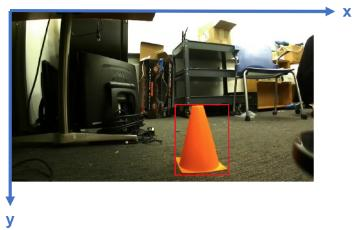
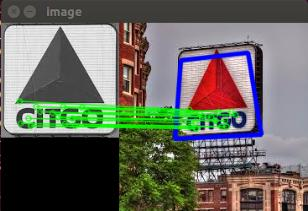
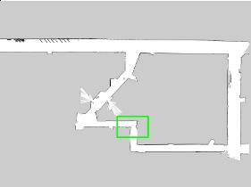
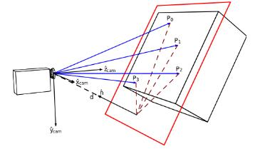
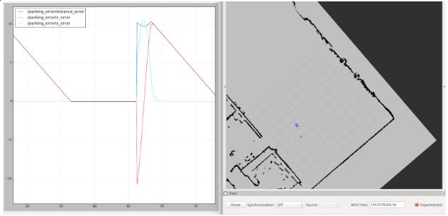

# Lab 4: Vision

Welcome to Lab 4, where you will learn how to use the camera to allow the racecar to park in front of a colored cone and follow a line. 

In this lab, your team will do the following:
- Experiment/Prototype with several types of object detection algorithms
- Learn how to transform a pixel from an image to a real world plane
- Develop a parking controller to park your robot in front of an orange cone
- Extend your parking controller into a line following controller

### Lab Modules
This lab has a lot in it, so we are encouraging parallelization by breaking up the components of the lab into 4 distinct modules, which you will combine together. Each module tackles an interesting problem in computer vision/controls, and is designed to be implemented (initially) by itself.  
- Module 1: Cone Detection via Color Segmentation
- Module 2: Object Detection via Template Matching and SIFT
- Module 3: Transforming pixels to a plane via Homography
- Module 4: Writing a parking controller.

Here’s how they fit together. Modules 1 and 2 cover object detection algorithms. Comparing different algorithms will give you a better feel for what is out there. Module 3 will teach you how to convert a pixel to a plane in the real world. Combining 1 and 3 will tell you where a cone is relative to your robot. Module 4 will park a robot in front of a simulated cone. Bring in modules 1 and 3 and put it on hardware to park in real life. Now make some modifications to follow a line instead!

### Bringing it together:
With your modules in hand it is time to make your robot park in front of a cone. Here are suggested steps:
1. Write a ros node using Modules 1 and 3 that publishes the relative location of a cone in view of the ZED Camera. Make sure you can see the cone in rviz before trying to do control. You should now be able to move the cone around on the floor and accurately determine its position relative to the car using just the camera. Make sure to publish a Marker to RVIZ representing the cone. The rviz cone should appear where the real cone does.
2. Now bring in Module 4. Listen to the relative cone location and publish drive commands. Congratulations are in order when you can park successfully. 
3. Modify module 1 such that your robot can follow a line instead of a cone. Details in the module 1 handout.
4. Improve your line following controller to see how fast you can navigate a circular track. 

### Computer Setup
For this lab, you will need Opencv3. The virtual machines already have it, but it likely needs to be updated to 3.4 and are missing the opencv-contrib package (this is where some propietary algorithms were moved to in opencv3). If you are running linux natively, depending on what you've done before you may or may not have the correct setup. Try running these commands as well, and the correct packages will install as needed.

Steps:

`sudo apt-get install python-pip`

`pip install opencv-python==3.4.2.16`

`pip install opencv-contrib-python==3.4.2.16`

`pip install imutils`

### Analysis:
We are also looking for a bit more in terms of experimental analysis in the lab than we have in the past. We are, in particular, looking for analysis of your vision algorithms and and controller.

Vision Analysis:
We wrote some code to test the Intersection over Union (IOU) scores of your vision algorithms on the three datasets provided. IOU is a measure of how accurate bounding boxes are, and is  a choice metric for analysis of object detection algorithms. Go into **computer_vision/**  and run:
- python cv_test.py citgo
- python cv_test.py cone
- python cv_test.py map  
To test all three of your algorithms against our citgo, cone, and stata basement datasets respectively. Results will be outputted to .csv files in **scores/**. Some algorithms on some datasets won’t get any/good results. This is expected, and we would like to know why each works for what it does in your presentation.

Controller analysis: 
When you wrote the parking controller (module 4), you published error messages. Now it’s time to use **rqt_plot** to generate some plots. Try running the following experiments:
- Put a cone directly in front of the car, ~3-5 meters away. Your car should drive straight forward and stop in front of the cone. Show us plots of x-error and total-error over time, and be prepared to discuss.
- Run the car on one of our tracks, and check out the plots for any interesting error signals. Compare plots at different speeds, and see how error signals change with speed.
### Grading: /10
Technical implementation
- 1 point for satisfactory completion of module 1
- 1 point for satisfactory completion of module 2
- 1 point for satisfactory completion of module 3
- 1 point for satisfactory completion of module 4
- 1 point for successful integration of the 4 components

Evaluation (include in presentation):
- 2 points for explaining vision algorithm strengths and weaknesses. Why does each algorithm perform as it does on each dataset?
- 1 point for explaining the homography transformation. How do we convert pixels to plane coordinates?
- 1 point for demonstrating and explaining performance of the parking controller. Make sure you mention your method for tuning the controller gains. Hint: include error plots from **rqt_plot**
- 1 point for demonstrating and explaining performance of the line-follower. Make sure you mention your method for tuning the controller gains. Hint: include error plots from **rqt_plot**

Bonus:
- +1 point for the fastest line follower on the circular track. Have a TA record your time. 

# Module 1: Cone Detection Via Color Segmentation
In lecture we learned lots of different ways to detect objects. Sometimes it pays to train a fancy neural net to do the job. Sometimes we are willing to wait and let SIFT find it. Template matching is cool too.

But sometimes simple algorithms are the correct choice, and for our purposes, identifying the cone by its distinctive color will prove most effective. Your job in this module will be identify cones (and other orange objects) and output bounding boxes containing them.

Take a peek at **cone_detection/color_segmentation.py**. Here you will find your starter code, though there is very little of it. There is a considerable degree of freedom in implementing your segmentation algorithm, and we will try to guide you at a high level. When it comes to opencv functions and examples, googling will not disappoint. Keywords like “python” and “opencv3” will help you avoid c++ and older opencv versions of functions.

The cool thing about this module is that you can build up your algorithm incrementally. Display the original image. Modify, convert, filter, etc. and see what it looks like. Try a different opencv function. See what that does to the already changed image.

Here are some helpful hints:
- As we’ve seen in lecture, there are different color spaces. You are probably used to RGB/BGR, but you’ll find the HUE in HSV to vary less with lighting. Try cvtColor. Speaking of, the images here are BGR, not RBG.
- Use cv2.inRange to apply a mask over your image, keeping just what you want.
- Erosion and dilation are a great way to remove outliers and give your cone a bit more of a defined shape.
- OpenCV contour functions can prove very helpful. cv2.findContours + cv2.boundingRect are a powerful combination. Just saying.

Don’t forget conventions! Image indexing works like this (in this lab):

### Evaluation: 
We are using the Intersection Over Union metric for evaluating bounding box success. Run **python cv_test.py cone color** to test your algorithm against our dataset. We print out the IOU values for you. We expect some sort of analysis involving this metric in your presentation.
By the way- you won’t get them all (probably). But 100% accuracy is not necessary for a great parking controller.

### Line Follower Extension:
After you and your team put your modules together to park in front of a cone, a quick modification of your code will create a line follower. Like a donkey chasing a carrot, if you restrict the view of your robot to what is a little ahead of it you will follow an orange line.

This works by setting a lookahead distance. See an example [here](https://gfycat.com/SeveralQueasyAmberpenshell).

Check out [this](https://www.youtube.com/watch?v=uSGnbyWg3_g) demo of what your robot can do. 
There will be several tape "courses" set up throughout the lab. Your racecar should be able to drive around them in a controlled manner - not getting lost or cutting corners. Once you can drive around the course, see how fast you can go. 

# Module 2: Objection Detection via **SIFT** and **Template Matching**
We’ve taught you some interesting ways to discover objects, and now it’s time to play with them. We want you walking away (to present to us) with two critical pieces of information from this module:
- Why these two algorithms are super useful
- Why these two algorithms fail to detect the cone super well

Since the best learning comes from doing, we will be having you use each algorithm where it’s particularly effective. Check out **computer_vision/test_images_localization** and **computer_vision/test_images_citgo** to see pictures from two datasets. One dataset contains pictures of the Boston CITGO sign from various angles. The other contains scraps of the stata basement (2D) map.

**CITGO:** Imagine a drone, on a delivery mission. Your target, a workman, called for a sandwich while changing the bulbs in the C on Boston’s most iconic advert. He took a snapshot of the nearest landmark on his cellphone, and we are using that (template) to find him with our camera.

**STATA:** A wheeled robot needs to find its location on a map. It takes a laser scan, and comes up with a local view of what it can see. It tries to locate the local (template) scan on a big map, knowing that the center pixel of the highest scoring bounding box will correspond to its current location. By converting from pixels to meters, the robot will know where it is.

We have two algorithms to implement, SIFT and Template Matching. Each algorithm has strengths and weaknesses, and the goal for this lab will be to get a better feel for what they are.

Check out **computer_vision/sift_template.py** in the lab4 folder. In there you will find two partially completed functions. Each function tries to find a templated image in a larger background image, and returns the bounding box coordinates of the target object in the background.

**On implementing SIFT**      
Test your algorithm against the CITGO dataset. This dataset should give you the stronger results. Run **python cv_test.py citgo sift**

**On implementing Template Matching**        
Test your algorithm against the STATA dataset. Run **python cv_test.py map template**        

**Testing on Datasets**         
We have implemented a few datasets for you to test your algorithms with.  To run the Sift tests, type in (inside the **computer_vision** folder): 
- **python cv_test.py cone sift**
- **python cv_test.py citgo sift**
- **python cv_test.py map sift**            

To test your template matching:
- **python cv_test.py cone template**
- **python cv_test.py map template**
- **python cv_test.py citgo template**            

Some of these algorithm + dataset combinations will not produce good results. Each algorithm has different strong suits. Do you see why?

# Module 3: Locating the cone via **Homography Transformation**
In this section you will use the camera to determine the position of a cone relative to the racecar. This module of the lab involves working on the car. 
### Launching the ZED Camera
- On the car, use `roslaunch zed_wrapper zed.launch` to launch ZED
- See lab 1 for instructions on how to export ROS_MASTER, then run `rqt_image_view` from your host computer
The ZED publishes to a number of topics topics which you can learn about [here](https://docs.stereolabs.com/integrations/ros/getting-started/#displaying-zed-data). To view them, select the topic name through the dropdown menu. Do not use the depth image for this lab. The one you probably want to use is the default rectified camera: `/zed/rgb/image_rect_color`. If your ZED camera is not working, try running this script `~/zed/compiled_samples/ZED_Camera_Control`. 

### Accessing Image Data
Write a ros subscriber for ZED camera topic.
The ZED camera publishes message of type [Image](http://docs.ros.org/api/sensor_msgs/html/msg/Image.html) from sensor_msgs. 
Learn about this message with the rosmsg command, `rosmsg show sensor_msgs/Image`. 
The image data is in ROS message data-structure which is not directly recognized by OpenCV, you might have also learned that OpenCV image representations are sometimes unique and bizarre(e.g. BGR instead of RGB). To convert between CV image data structures(mat) to ROS image representations(ROS Message structures) you may find [CV bridge](http://wiki.ros.org/cv_bridge/Tutorials/ConvertingBetweenROSImagesAndOpenCVImagesPython) helpful.
**NOTE: The velodyne cameras are upside down (fix with imutils.rotate() or similar)**

### Converting pixel coordinates to x-y coordinates
If you recall from lecture, a camera is a sensor that converts 3D points (x,y,z) into 2D pixels (u,v). If we put on our linear algebra hats, we can take a peek at the projection of a 3D point to a 2D point:

In robotics, we are generally concerned with the inverse problem. Given a 2D (image) point, how can we extract a 3D (world) point?
We need some tools and tricks to make that sort of calculation, as we lost (depth) information projecting down to our 2D pixel. Stereo cameras, for example, coordinate points seen from two cameras to add information and retrieve the X-Y-Z coordinates.
In this lab, we will use another interesting fact about linear transformations for back out X-Y positions of pixels.

### Coordinate space conversion
The racecar can’t roll over or fly (no matter how cool it might look), so the ZED camera will always have a fixed placement with respect to the ground plane. By determining exactly what that placement is, we can compute a function that takes in image pixel coordinates (u, v) and returns the coordinates of the point on the floor (x, y) relative to the car that projects onto the pixel (u, v).

This “function” is called a homography. Even though we can’t back out arbitrary 3D points from 2D pixels without lots of extra work, we can back out 2D world points if those points lie on a plane (and can therefore be thought of as 2D) that is fixed with respect to our camera.

Check out this illustration of a camera and world plane. There exists a linear transformation between the camera projection and the world plane, since the world plane has two dimensions like an image plane.

### Find the Homography Matrix
To find the homography matrix, you should first determine the pixel coordinates of several real world points. You should then measure the physical coordinates of these points on the 2D ground plane. If you gather enough of these point correspondences (at least 4), you have enough information to compute a homography matrix:

#### Notes for finding the homography matrix:
- The opencv findhomography implementation expects 3X1 data points in homogenous coordinates [X,Y,1].
- You may need to rescale the homography output X',Y',Z' such that Z' = 1.

Many existing packages including [OpenCV](https://docs.opencv.org/2.4/modules/calib3d/doc/camera_calibration_and_3d_reconstruction.html#findhomography) can be used to compute homography matrices. 

`rqt_image_view` will be a useful debugging tool here. If you enable mouse clicking (there is a checkbox next to the topic name), then `rqt_image_view` will publish the pixel coordinates of points you click on in the image to a topic like this: `/zed/rgb/image_rect_color_mouse_left`. Publish a marker to RVIZ using this pixel, and you should be able to quickly tell if your homography matrix is doing its job.

# Module 4: Controller for Parking and Line Following
While your teammates are putting together the computer vision algorithms and localizing the cone, you will also implement a parking controller for the robot. We want you to implement a parking controller that parks your robot in front of a cone at a given distance. The robot will start with the cone in the field of view of the camera and should drive directly to the cone and park in front of it (1.5 - 2 feet from the front). Parking means facing the cone at the correct distance, not just stopping at the correct distance. See an example video [here](https://gfycat.com/ObeseVioletIcelandicsheepdog).

The distance and angle don’t act independently so consider carefully how you should make them work together.

Whenever possible, we want to develop controllers in simulation before deploying on real (breakable) hardware. That is what we’ll do here. After you download (and make) the lab 4 ros package, fire up your **roscore**, **simulator**, and **rviz**. 

Now run `roslaunch lab4 parking_sim.launch`

In rviz, press **publish point**(top options bar) and watch our representation of a cone appear. 
Notes
- Make sure to add the marker “/cone_marker” to rviz
- In this lab, make sure you are in the “Map” frame or things might get weird.

If you `rostopic echo /relative_cone`, you should be able to see the relative coordinates of the cone in the 'base_link' (control) frame.

Open up `scripts/parking_controller.py`, We’ve subscribed to the “/relative_cone” topic for you, and have set up the publisher/callback as well. Your job is to take the cone_location message (either print or use a `rosmsg show lab4/cone_location` to find out what is in it), and write a control policy that parks in front of the cone. Publish desired steering angles and velocity just like in lab2.

We aren’t aiming to give you a specific algorithm to run your controller, and we encourage you to play around. Try answering these questions:
- What should the robot do if the cone is far in front?
- What should the robot do if it is too close?
- What if the robot isn’t too close or far, but the cone isn’t directly in front of the robot?
- How can we keep the cone in frame when we are using our real camera?

A good parking controller will work in simulation even when the cone is behind the robot. Of course, when we put this module together with the rest of the lab on the real robot, you won’t have the luxury of knowing the cone location when the camera can’t see it. 

Please keep your desired velocities below 1 (meters/sec). Even though the simulator will behave at higher speeds, your real robot will not.

The last thing for you to do is publish the x_error, y_error, and distance (`sqrt(x**2 + y**2)`) error. Fire up a terminal and type in: `rqt_plot`. A gui should emerge, which gives you the ability to view a live plot of (numerical) ros messages.

These plots are super useful in controller tuning/debugging (and any other time you need to plot some quantity over time).
Tips: 
- Type in the topic you want to graph in the top left of the gui.
- Adjust the axes with the icon that looks like a green checkmark (top left menu bar).

You will be using these plots to demonstrate controller performance for your presentation. 

### General Tips/FAQ:
Camera Resolution:  
If you are noticing problems with data rate from the camera, the ZED camera is publishing higher resolution photos than you need. We can turn down the image quality to VGA quality by modifying the resolution parameter in zed_camera.launch to 3.

Debugging cone detection on the car:  
The actual cones and orange tape tracks != dataset cones. One useful debug step is to publish live pictures (particularly, the HSV mask). This should let you debug in realtime. (You are already converting ros images to opencv images, simply reverse that conversion with cv2_to_imgmsg. Now publish that Image over a debug publisher and you should be able to pull up the live image stream in rqt_image_view/rviz.)  
